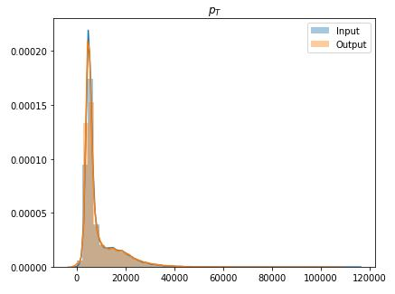
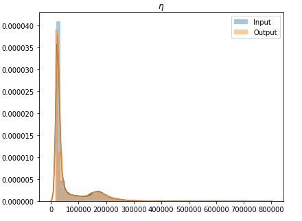
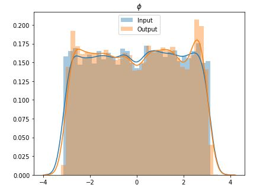
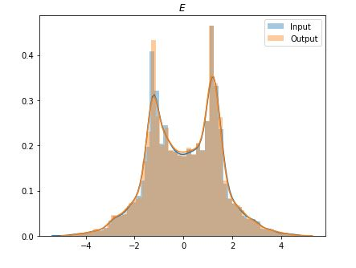

# ATLAS Autoencoders project evaluation exercise
The task given was to compress ATLAS trigger jet events data using an autoencoder. 
The training and test data are stored as all_jets_train_4D_100_percent.pkl and all_jets_test_4D_100_percent.pkl respectively. 
These pickle files are loaded using the read_pickle method in pandas. 

# Approach
The given training and test data are normalized to have 0 mean and unit standard deviation (also called standardization) to speed up the training process. 
The optimal learning rate can be found from the loss vs learning rate plot. To find the optimal learning rate, we find the point on the curve with the steepest downward slope that still has a high value. 
We then train our model and this model is stored in the models folder as AE_3D_200_final_model.pth. 
The batch size used to train our model is 256, the loss function is MSELoss(), and the activation function is tanh(). 
The nn_utils file is used to import our model which is AE_3D_200(). 

# Steps to run the autoencoder
Keep the nn_utils module and the AutoEncoder.ipynb file in the same folder and open jupyter notebook using this folder as the current working directory. 
We can change our current working directory in jupyter notebook by using the %cd command. 
If we want to load the trained model, we can do so by using learn.load method, else we can train our model on the training and test datasets that are given in this repository (these files have to be kept in the same folder as our AutoEncoder.ipynb file). 
Make sure that the required libraries are installed, otherwise install them using the pip package manager. 
After completing these steps, we can now run our AutoEncoder.ipynb file from a jupyter notebook.

# Reconstruction Loss Plots
 | 
 | 
 
As we can see from these plots, our autoencoder has reconstructed the original data with minimal loss of information. 
Thus an autoencoder that encodes the given 4 dimensional data to 3 dimensions and reconstructs the original 4 dimensional data with minimal loss has been successfully implemented. 
The HEPAutoencoder that was built on the master [thesis](https://lup.lub.lu.se/student-papers/search/publication/9004751) project of Eric Wulff can be found [here](https://github.com/Skelpdar/HEPAutoencoders).
